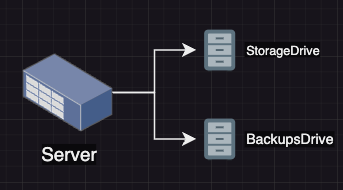

# Presentation
##  Welcome to our presentation's repository. 
 This repository contains links and resources to our slide show presentation. Once our video presentation is available, it will be added to this repository as well. This project is the culmination to our OPS-201 course utilizing problem framing, troubleshooting methology, and network engineering skills.  

[SlideShow](./TeamKnonSense.pdf)

